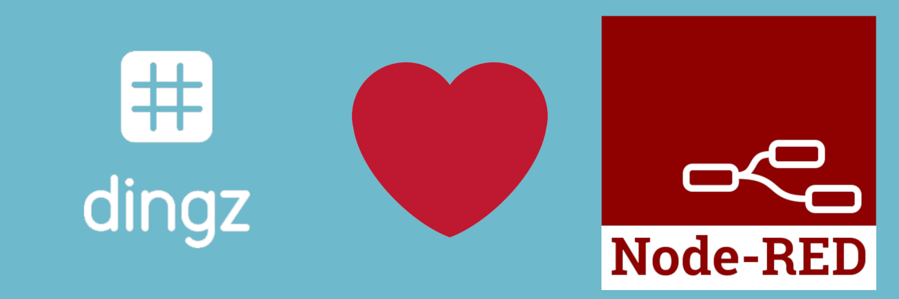

### Features

- Control nodes via JSON input flows or by simply setting the values in the properties menu
- Automatic discovery of dingz devices
- Status message of how the message was sent or if device is reachable

### Installation

dingz-Node-RED was written in **Node.js** v4.2.6 and tested on Node-RED v0.19.4.

To use it execute `npm install node-red-contrib-dingz`.

### Bugs

Please report all bugs through the Github issues page. Your help is greatly appreciated.

### Nodes

- [dingz Input](#dingz-Input)
- [dingz Output](#dingz-Output)

---

#### dingz Input

Usage:

- Specify dingz Input device by providing ip and mac or using automatic discovery
- Connect devices to the output ports
- Press the button on the left side of the dingz input node to upload the configuration to the dingz devices.

#### dingz Output

Usage:

- Specify which output should be set to what value
- Will run every time it gets any input.
